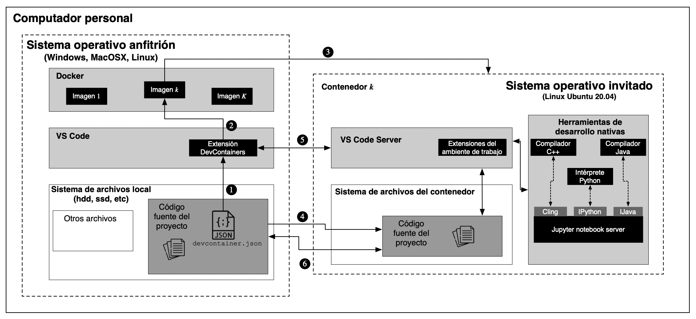

# Arquitectura de desarrollo

La arquitectura que se desarrolló tiene por objetivo permitir a las personas que están tomando el ramo de Programación II tengan un ambiente de desarrollo coherente, de uso personal y que no efecte la calidad de las entregas de las tareas. Además, permite repasar conceptos y realizar ejercicios de programación.

La arquitectura de desarrollo se muestra en la Figura 1. Consiste en dos grandes bloques, representados por el Sistema Operatio nativo del computador, que se denomina **Sistema Operativo anfitrión** y un Sistema Operativo que se carga sobre este último, llamado **Sistema Operativo invitado**. En el lado del anfitrión, se utiliza el programa de desarrollo `VS Code` y del sistema de virtualización `Docker`. Cuando se abre la carpeta donde reside el proyecto a través de VS Code, este programa busca un archivo de configuración con nombre `.devcontainer.json`. Si este archivo existe, llama a la extensión `DevContainers` (1). Esta extensión revisa la estructura y sintaxis de este archivo y si no tiene errores, invoca a Docker para que ejecute la imagen que se especifica en el archivo de configuración (2). La ejecución de una imagen en el sistema Docker implica que se genera un `contenedor` que ejecuta un sistema operativo en particular (3). En este caso, se levanta un Sistema Operativo Linux Ubuntu 20.04. Si bien no es la última versión de esta distribución, utlizarla no afecta el objetivo del ambiente de desarrollo.

Una vez que el Sistema Operativo del contenedor está operativo, el sistema Docker implementa un sistema que permite acceder a los archivos de la carpeta que se abrió para dar inicio al paso (1). Estas referencias permiten que el Sistema Operativo invitado pueda acceder a los archivos que están en el anfitrión (4).

Luego, el programa `VS Code` que se ejecuta en el anfitrión, inicia el proceso `VS Cde server` en el Sistema Operatibo invitado (5). Este servidor permite acceder a los archivos del proyecto, editarlo, modificarlos, crear otros archivos, ejecutarlos con las **Herramientas de desarrollo Nativas** que ya están instaladas en el contenedor. etc. El sistema Docker y el proceso VS Code Server permiten mantener la coherencia de los archivos.

<figure>
    

        
         
        <figure-caption>Figura 1. Arquitectura de desarrollo basada en VS Code y Docker.
        <figure-caption>
    

</figure>

# Sofware instaladado

**Compiladores e intérpretes**

* Compilador C++17 g++ 9.4.0
* openJDK 11
* Python 3.8.10
* Jupyter notebook server

**Jupyter Kernels**

* IPython para ejecutar script de python.
* IJava para ejecutar código Java.
* Cling-cpp17 para ejecutar código C++17.

**VS Code extensions**

* ms-python.python
* ms-toolsai.jupyter
* ms-vscode.cpptools-extension-pack
* lfm.vscode-makefile-term
* ms-vscode.makefile-tools
* redhat.java
* hnw.vscode-auto-open-markdown-preview
* ms-toolsai.datawrangler