# Implantación del ambiente de desarrollo

## Software base

Los ejemplos y las tareas de la asignatura se realizarán utilizando VS Code como herramienta de desarrollo y Docker como tecnología de infraestructura. Para lograr esto, en su computador deberá instalar:

* [VS Code](https://code.visualstudio.com)
* [Docker desktop](https://docs.docker.com/get-docker/)
* [GitHub CLI](https://github.com/cli/cli#installation)


**Observación**: Se recomienda que en la instalación de VS Code, se seleccione la opción "Agregar opción Abrir con VS Code" a archivos y directorios. Esta opción está sólo disponible para la versión de Windows. Si utiliza MacOSX, deberá seguir las instrucciones que se detallan [este enlace](https://github.com/g-courses/inf214/blob/main/vscode-macos-menu-contextual.md).

## Instalación del contenedor de desarrollo 
1) Crear una carpeta y, en forma opcional, abrir un terminal dentro de esa carpeta

<figure>
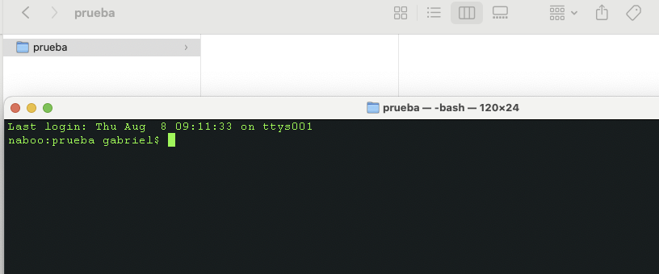
<figure-caption>Figura 1. Ejemplo de creación de carpeta "prueba" y terminal asociado a dicho elemento</figure-caption>
</figure>

<br />
<br />

2) Clone este repositorio. Si utiliza el terminal del sistema operativo, puede ejecutar el siguiente comando dentro de una carpeta previamente seleccionada.

```
git clone https://github.com/g-courses/inf214.git
```

<figure>
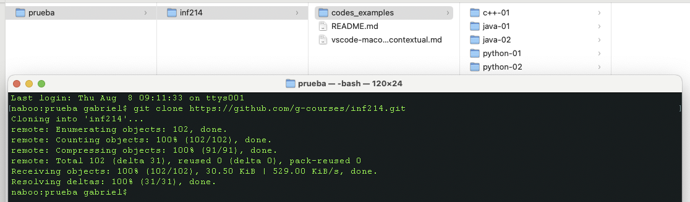
<figure-caption>Figura 2. Clonación a través del comando git</figure-caption>
</figure>

<br>

3) En el explorador de archivos, seleccione `Abrir con VS Code` en el menú contextual de la carpeta `codes_examples`.

<figure>
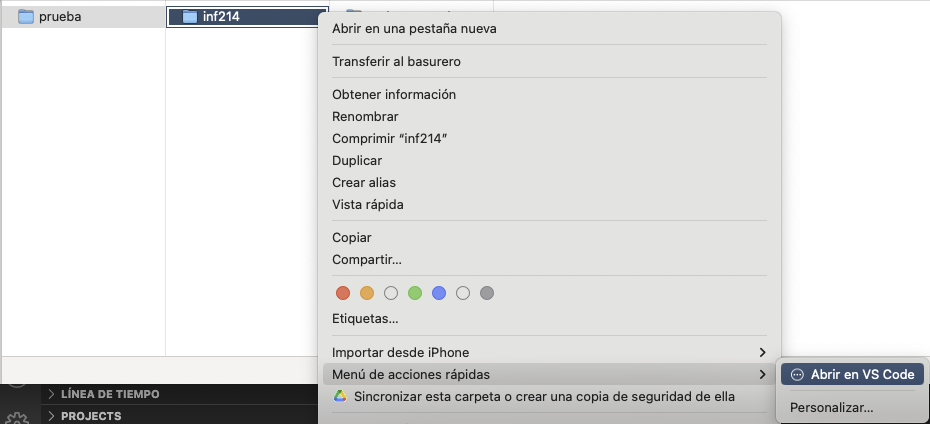
<figure-caption>Figura 3. Selección opción "Abrir con VS Code" en el caso de MacOSX</figure-caption>
</figure>

<br>


4) Una vez que VS Code se ejecute, mostrará un aviso como el de la Figura 4. Seleccione **Volver a abrir en el contenedor**.

<figure>
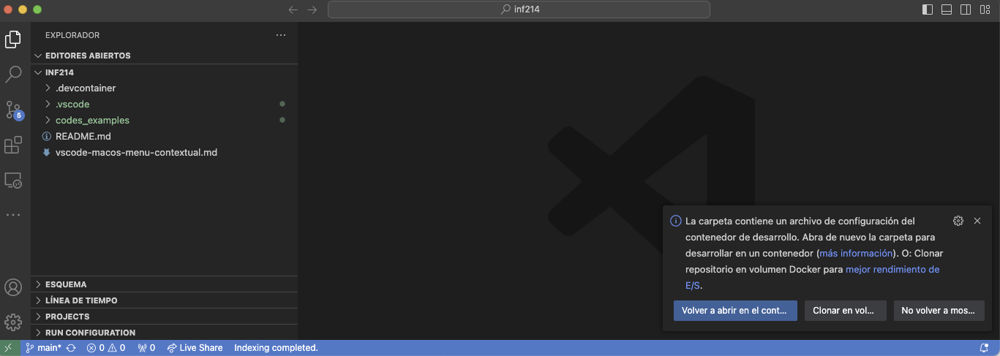
<figure-caption>Figura 4. VS Code avisa que encotró una configura de un contenedor de desarrollo, por lo que es necesario abrir nuevamente la carpeta con esta opción.</figure-caption>
</figure>

<br>

5) Si el aviso anterior desaparece, entonces seleccione el complemento "Explorador remoto" y abra la carpeta en el contenedor de desarrollo de la asignatura.

<figure>
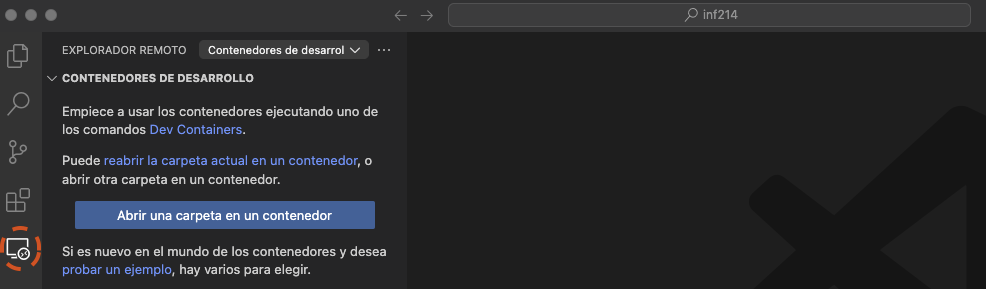
<figure-caption>Figura 5. Abrir la carpeta en un contenedor de desarrollo. Esta opción abrirá y ejectura el contenedor de desarrollo de la asignatura.</figure-caption>
</figure>

<br>

6) Una vez realizado el paso 4 o 5, VS Code para por distinto estados, tal como muestran en la Figura 6. El primer paso la primera vez se puede demorar debido a que tiene que bajar la imagen del contenedor, cuyo tamaño es de aproximadamente 7 GB.

<figure>
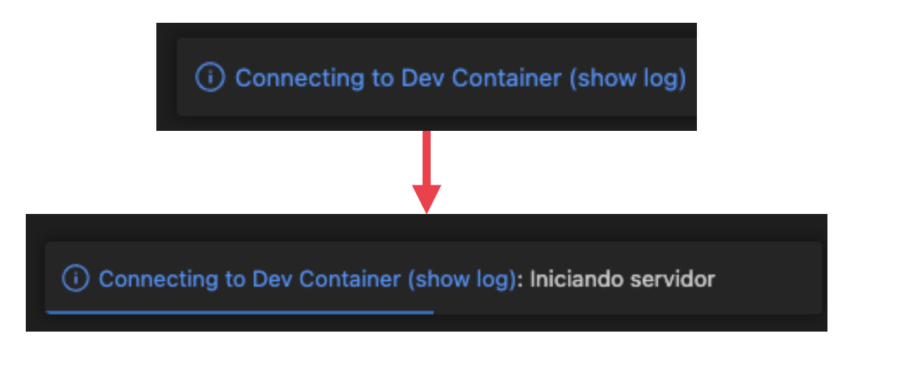
<figure-caption>Figura 6. En la esquina inferior derecha VS Code muestra el estado de preparación del ambiente de desarrollo</figure-caption>
</figure>

<br>

7) Una vez que la imagen está configurada, VS Code tendrá una apariencia similar a la que se muestra en la Figura 7.

<figure>
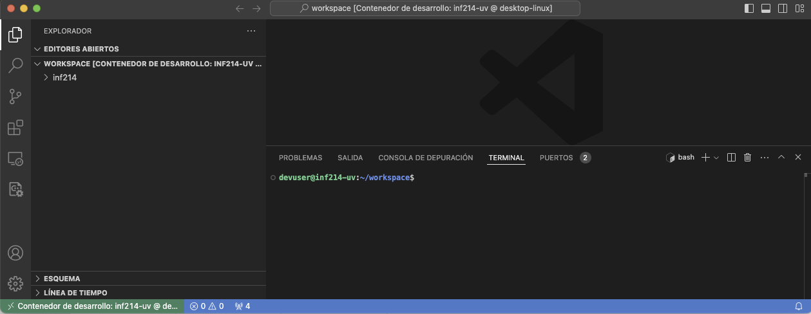
<figure-caption>Figura 7. Ambiente de desarrollo instalado con éxito. En la ventana "Workspace" debe estar una carpeta con nombre "inf214"</figure-caption>
</figure>

<br>

## Prueba de funcionamiento del intérprete Python del contenedor de desarrollo

El contenido de desarrollo tiene todo lo necesario para el desarrollo de la asignatura: compiladores de C++, Java e intérprete de Python. Además, tiene los complementos de VS Code para facilitar la codificación en estos lenguajes. Se debe destacar que **no es necesario que estas herramientas estén instaladas en su computador**. Esto ya está resuelto a nivel del contenedor de desarrollo.

1) Seleccione la carpeta `inf214` y luego `codes_examples`, tal como se muestra en la Figura 8

<figure>
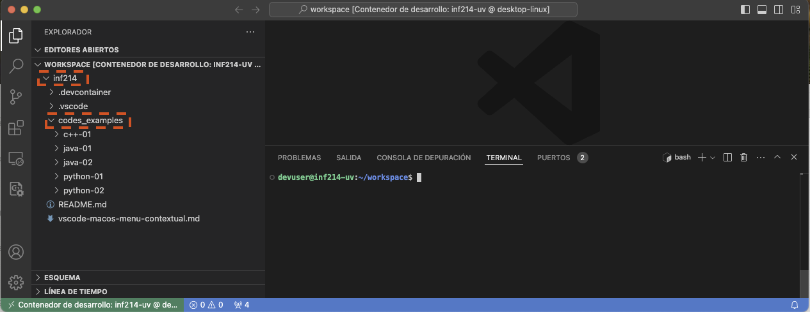
<figure-caption>Figura 8. Selección de carpetas en el constenedor de desarrollo.</figure-caption>
</figure>

<br>

2) Luego, seleccione el script `poli01.py` dentro de la carpte `python01`. Si el ambiente está bien instalado, debiera visualizarse el ícono `play` en el sector superior derecho (Figura 9).

<figure>
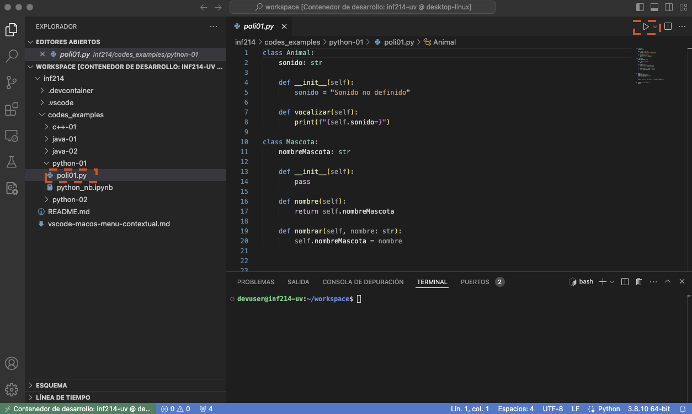
<figure-caption>Figura 9. Selección de carpetas en el constenedor de desarrollo.</figure-caption>
</figure>

<br>

3) Finalmente, presione `play`. En el sector del terminal, debiese tener similar a la que se muestra en la Figura 10.

<figure>
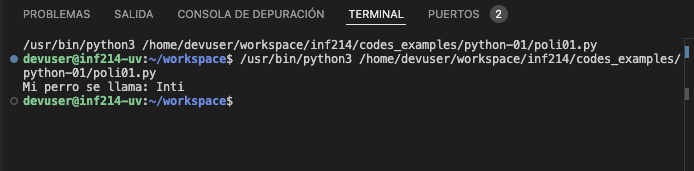
<figure-caption>Figura 10. Salida del script Python de prueba.</figure-caption>
</figure>

<br>

Para el caso de Java o C++, si bien se explicará en clases, se recomienda que usted intente compilar los códigos entregados.

## Prueba de funcionamiento de Jupyter server del contenedor de desarrollo

1) Seleccionar el archivo `python_nb.ipynb` y pinchar `Seleccionar el kernel` cerca de la esquina superior derecha (Figura 11).

<figure>
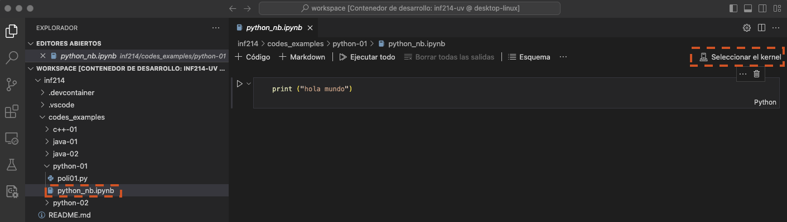
<figure-caption>Figura 11. Botón de seleccionar de kernel para un notebook jupyter.</figure-caption>
</figure>

<br>

2) Al seleccionar el kernel, aparecerá una lista de opciones en la línea de comandos de VS Code. Se debe acceder a la opción `Servidor de Jupyter existente...` (Figura 12).

<figure>
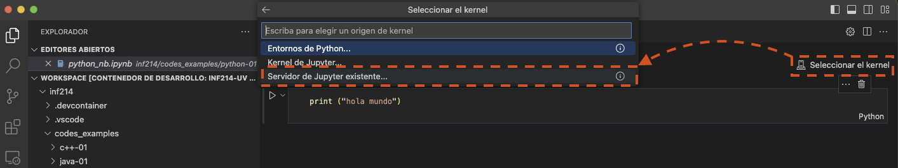
<figure-caption>Figura 12. Selección del kernel a utilizar. Se debe acceder a la opción "Servidor de Jupyter existente...".</figure-caption>
</figure>

<br>

3) Seleccionar la opción `Escriba la dirección URL ...` (Figura 13)

<figure>
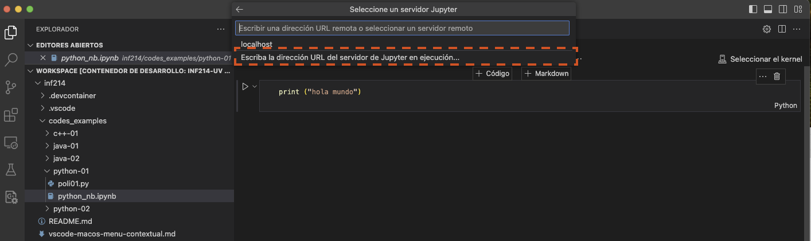
<figure-caption>Figura 13. Seleccionar escribir la URL del servidor ".</figure-caption>
</figure>
<br>

4) Escriba la dirección `http://localhost:8888`. Esta URL es la dirección de acceso al servidor Jupyter que esá instalada en el contenedor de desarrollo.

<figure>
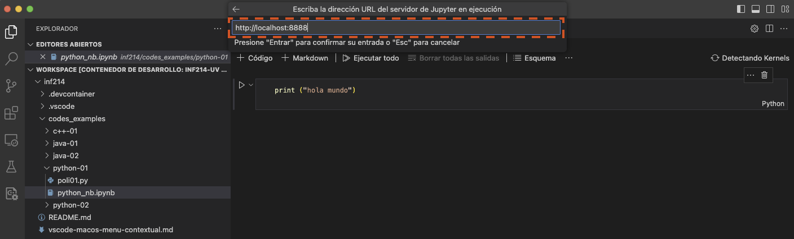
<figure-caption>Figura 14. Ingreso de la URL del servidor Jupyter instalado en el contenedor.</figure-caption>
</figure>

<br>

5) Debido a que el servidor Jupyter es de uso personal, su acceso es sin autenticación. Debido a esto, VS Code da un aviso de seguridad. Se debe seleccionar la opción `Sí`.

<figure>
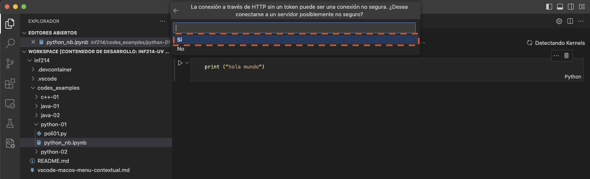
<figure-caption>Figura 14. Ingreso de la URL del servidor Jupyter instalado en el contenedor.</figure-caption>
</figure>

<br>


6) En forma opcional, se puede cambiar el nombre del servidor por uno más apropiado para la persona que lo va a utilizar (Figura 15).

<figure>
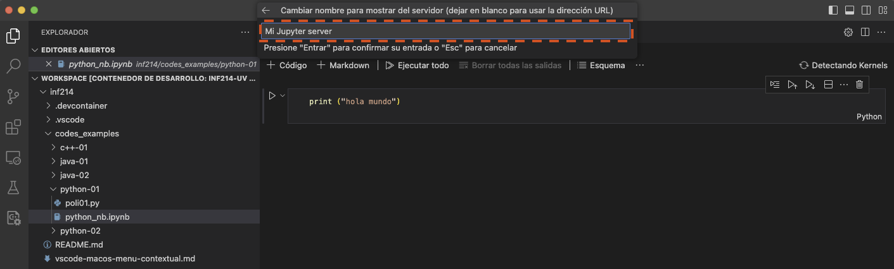
<figure-caption>Figura 15. Cambiar el nombre de acceso por uno más representantivo</figure-caption>
</figure>

<br>

7) Seleccionar el kernel que se necesita. En este caso, se debe seleccionar el kernel `Python 3`.

<figure>
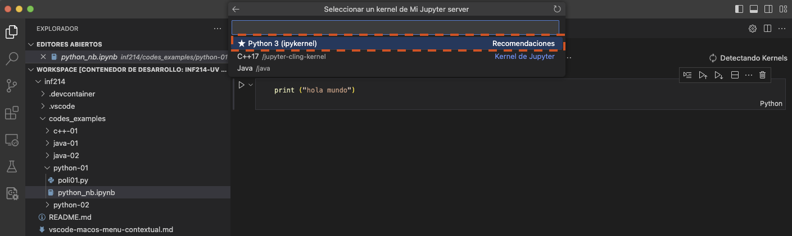
<figure-caption>Figura 15. Seleccionar el kernel apropiado para el notebook.</figure-caption>
</figure>

<br>

8) Luego del paso anterior, el kernel de `Python 3` ya está conectado (Figura 15) y el notebook se puede ejecutar (Figura 16)

<figure>
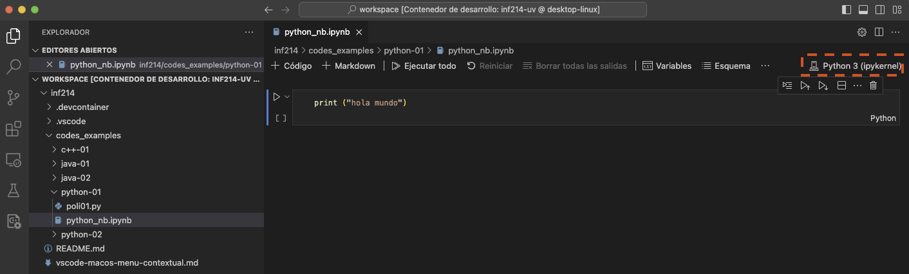
<figure-caption>Figura 15. Cambiar el nombre de acceso por uno más representantivo</figure-caption>
</figure>

<br>

<figure>
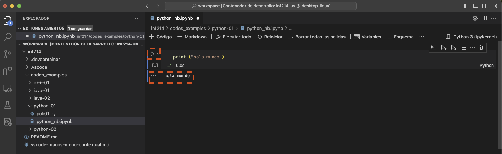
<figure-caption>Figura 16. Ejecución del código del notebook</figure-caption>
</figure>

<br>

Si aparece el mensaje `Hola mundo`, el servidor Jupyter está operando y su ambiente de desarrollo esta listo.
